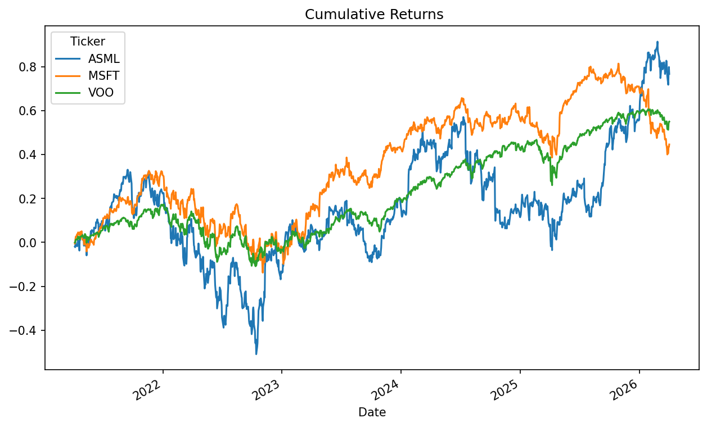

# TyrusBurton-Python-Finance-Projects
Python projects tracking my journey into financial analysis and data.

---

## Project 1: Cumulative Returns Analysis | ASML, MSFT, VOO

**Libraries:** yfinance, pandas, pandas_datareader, datetime, numpy, matplotlib

**Process:** Used yfinance to pull 5 years of historical data via the Yahoo Finance API, retrieving open, high, low, close, and volume for each ticker. Isolated the adjusted closing price, calculated daily log returns by dividing each day's price by the prior day's and taking the natural log, then applied cumsum to generate cumulative log returns across the full window. Plotted all three securities on a single time-series chart for direct comparison.

**Result:** ASML showed the highest volatility, dropping nearly 50% through 2023 before rebounding ~70% cumulative. MSFT finished around 40%, VOO around 50%.

